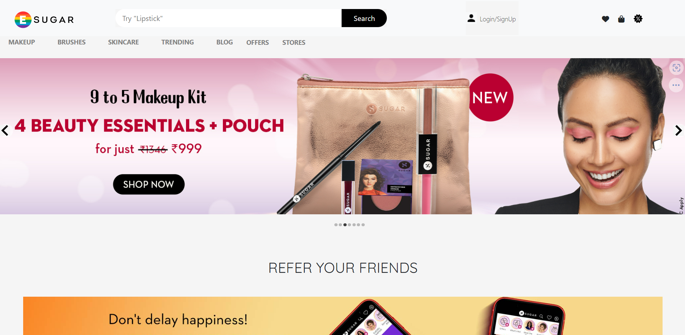
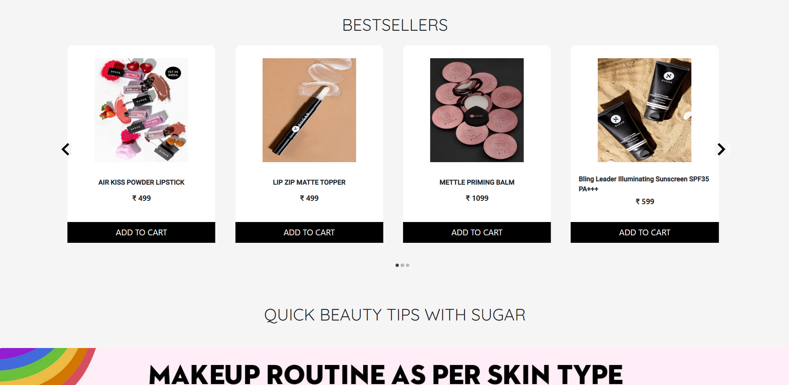
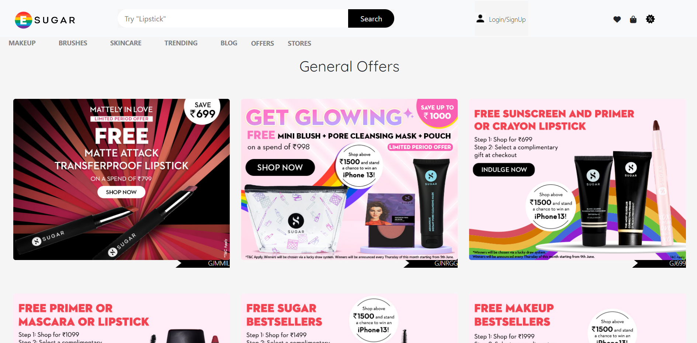

<h1>Sugar Cosmetics Clone :-</h1>

SUGAR Cosmetics is a cruelty-free makeup brand that offers a wide range of premium makeup products. It is a cult favorite amongst millennials and is one of the fastest-growing premium beauty brands in India. With its clutter-breaking persona, signature low-poly packaging, and chart-topping products, SUGAR is the makeup of choice for bold,independent women who refuse to be stereotyped into roles.

<h2>About this Project :-</h2>

This is a team project, built by us in the Construct Week - Unit 4 at Masai School.

Here is the link of our website live on netlify: - https://sugars.netlify.app/

<h2>Tech Stack used:</h2>

1) React

2) Redux

3) Chakra Ui

<h2>Screenshots of the Project :</h2>

 

 
 

 
 

 
 
<h2>TEAM MEMBERS :</h2>
Rahul Rajeevan
 
Nachiket Lele
 
Harishankar
 
Shubham Kapoor

